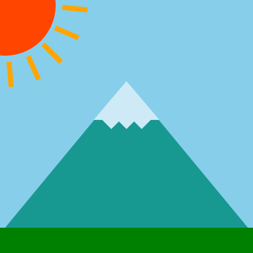

# jQuery Assignment #1

This assignment will be covering [`while`] loops, [`do...while`] loops, [creating new HTML elements][createElement], and [appending HTML elements][append] to an HTML file via [jQuery].

## Assignment

1. [Fork this repo][fork].

1. Only code inside the file named `script.js`. No editing any other files.

1. Create a `div` element with a class name of "**view**" and append it to the document `body` using jQuery. You can use [append], [appendTo], or any other jQuery method.

1. Create a `div` element with a class name of "**grass**" and append it to the previously created "view" div from step 3.

1. Create a `div` element with a class name of "**sun**" and append it to the previously created "view" div from step 3.

1. Write a [`while`] loop to create 5 divs. The div classes will be "**ray-1**", "**ray-2**", "**ray-3**", "**ray-4**", and "**ray-5**". Append each of these divs to the previously created "sun" div from step 5.

1. Create a `div` element with a class name of "**mountain**" and append it to the previously created "view" div from step 3.

1. Create a `div` element with a class name of "**mountain-top**" and append it to the previously created "mountain" div from step 7.

1. Write a [`do...while`] loop to create 3 divs. The div classes will be "**mountain-cap-1**", "**mountain-cap-2**", and "**mountain-cap-3**". Append each of these divs to the previously created "mountain-top" div from step 8.

### What the HTML should look like when you're done.

Remember, you're producing this HTML using jQuery. You cannot edit any file other than the `script.js` file.

```HTML
<div class="view">
    <div class="grass"></div>
    <div class="sun">
        <div class="ray-1"></div>
        <div class="ray-2"></div>
        <div class="ray-3"></div>
        <div class="ray-4"></div>
        <div class="ray-5"></div>
    </div>

    <div class="mountain">
        <div class="mountain-top">
            <div class="mountain-cap-1"></div>
            <div class="mountain-cap-2"></div>
            <div class="mountain-cap-3"></div>
        </div>
    </div>
</div>
```

### The HTML page should produce an image like so:



[`do...while`]: https://developer.mozilla.org/en-US/docs/Web/JavaScript/Reference/Statements/do...while
[`while`]: https://developer.mozilla.org/en-US/docs/Web/JavaScript/Reference/Statements/while
[append]: https://api.jquery.com/append/
[appendTo]: https://api.jquery.com/appendTo/
[createElement]: https://api.jquery.com/jQuery/#creating-new-elements
[fork]: https://github.com/karbassi-id/jQuery-assignment-1/fork
[jQuery]: https://jquery.com
