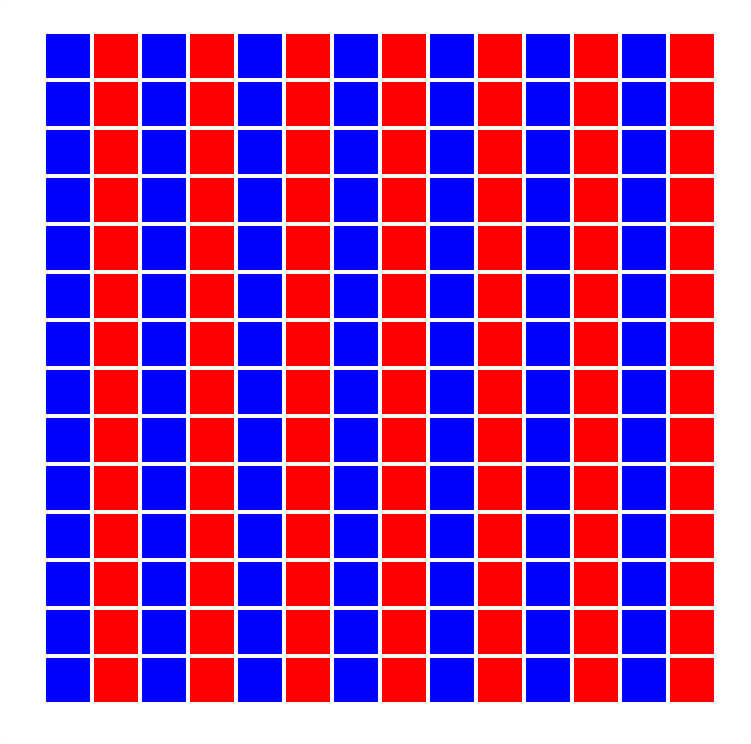

# jQuery Assignment #2

This assignment will be covering [`for`] loops, [creating new HTML elements][createElement], and [appending HTML elements][append] to an HTML file via [jQuery].

## Assignment

1. [Fork this repo][fork].

1. Only code inside the file named `script.js`. No editing any other files.

1. Create a [`for`] loop that creates 196 divs and will include the following:

   1. All the divs will have a class of `box`.

   1. All even-numbered divs will _also_ have the class of `type-1`.

   1. All odd-numbered divs will _also_ have the class of `type-2`.

1. All the divs created in step 3 will be appended to the document body.

1. Add an [click] event listener on all the created `box` divs in step 3 and 4. **Important**: You cannot do this with any type of loop.

**NOTE**: Remember, you're producing this HTML using jQuery. You cannot edit any file other than the `script.js` file.

### The HTML page should produce an image like so:

[`for`]: https://developer.mozilla.org/en-US/docs/Web/JavaScript/Reference/Statements/for
[append]: https://api.jquery.com/append/
[click]: https://api.jquery.com/click/
[createElement]: https://api.jquery.com/jQuery/#creating-new-elements
[fork]: https://github.com/karbassi-id/jQuery-assignment-1/fork
[jQuery]: https://jquery.com
